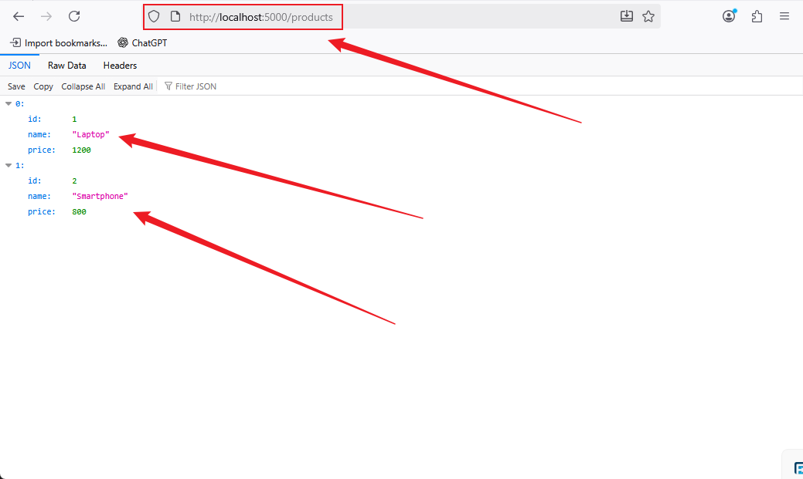
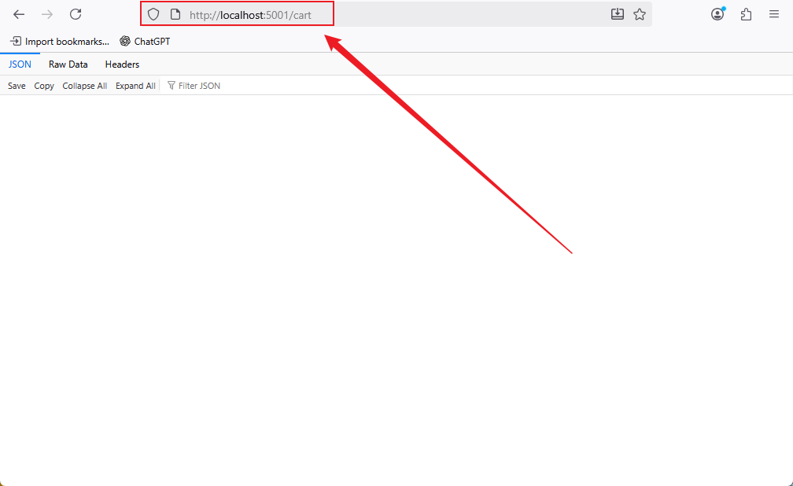
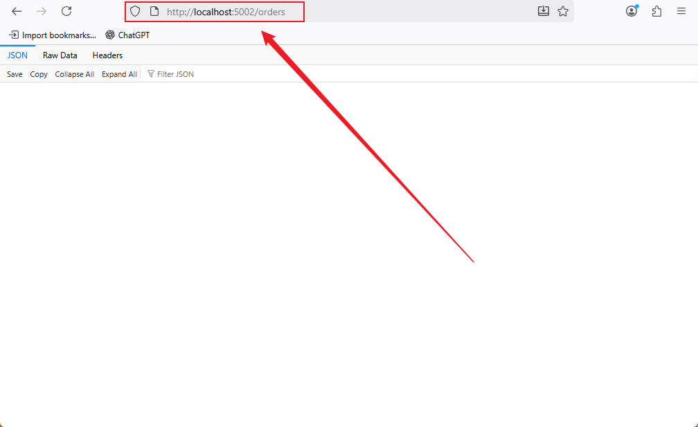
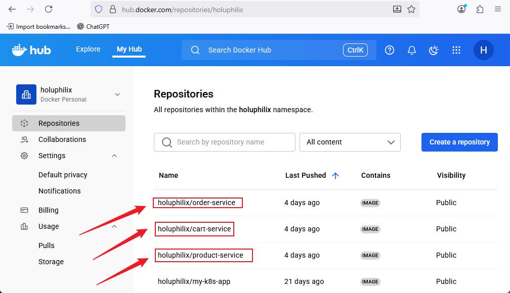
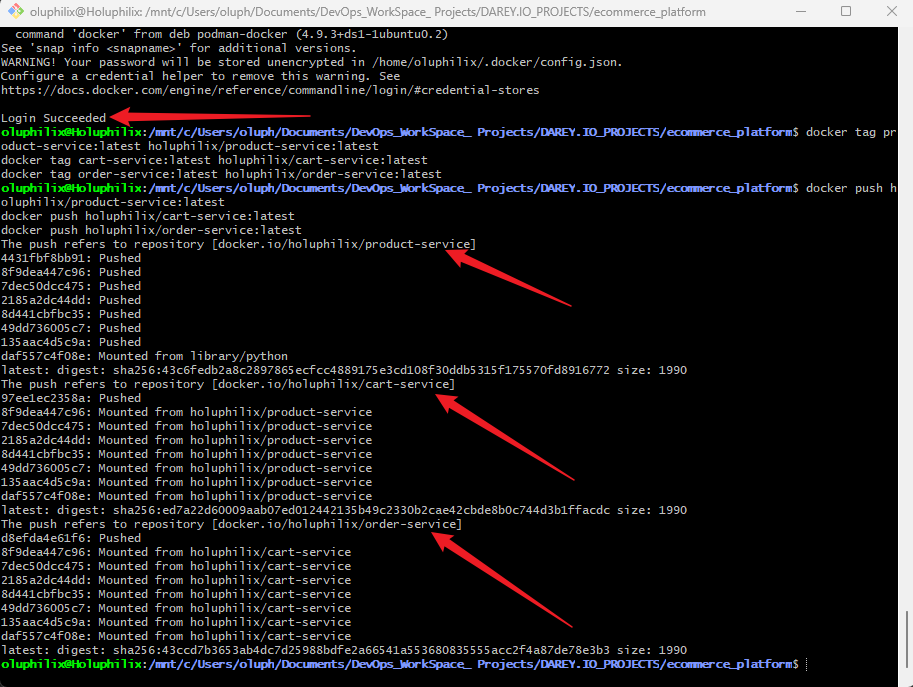
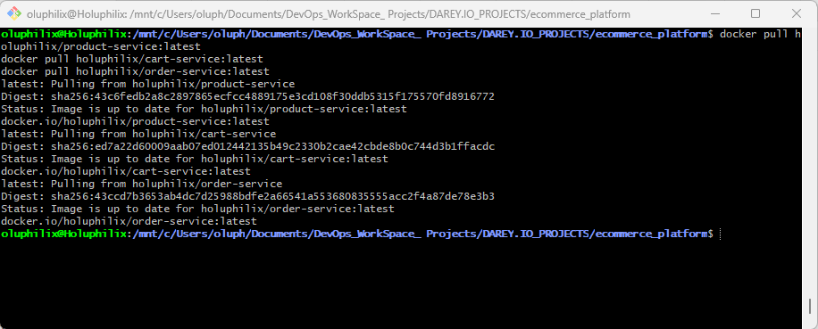

# **Capstone Project: E-Commerce Platform with Microservices Architecture**

## **Project Overview**

This project involves developing a modular e-commerce platform using a **microservices-based architecture**. Each microservice manages a distinct part of the application, such as product management, shopping cart operations, and order processing. The platform will be containerized using **Docker**, deployed on a **Kubernetes cluster**, and orchestrated using **ArgoCD**. Additionally, an **API Gateway** will expose the microservices to users.

## **Why is This Project Relevant**

Modern applications are increasingly moving toward **microservices architectures** for scalability, maintainability, and faster deployment. This project allows developers to gain practical experience in **containerization, orchestration, continuous deployment, and API management**, which are essential skills in real-world DevOps and cloud-native environments.

## **Project Goals and Objectives**

* Gain hands-on experience with **Docker**, **Kubernetes**, and **ArgoCD**.
* Implement a fully modular **microservices architecture**.
* Learn how to **deploy and manage services** in a production-like environment.
* Integrate an **API Gateway** to expose services effectively.
* Understand best practices in **monitoring, logging, and CI/CD workflows**.

## **Prerequisites**

* Basic knowledge of **Docker**, **Kubernetes**, and **Git**.
* Familiarity with **Python/Flask** or **Node.js/Express**.
* Access to a **Kubernetes cluster** (local with Minikube or cloud-based).
* Docker Hub account for pushing container images.

## **Project Deliverables**

* Dockerized microservices: `product-service`, `cart-service`, and `order-service`.
* Kubernetes deployment and service YAML files for each microservice.
* ArgoCD application manifests managing deployments.
* API Gateway configuration for routing traffic to microservices.
* Optional monitoring and logging setup using Prometheus, Grafana, and EFK stack.

## **Tools & Technologies Used**

* **Docker** – Containerization of microservices.
* **Kubernetes** – Orchestration and deployment of containers.
* **ArgoCD** – GitOps-based deployment management.
* **API Gateway (Kong/Ambassador)** – Routing and exposing services.
* **Git & GitHub** – Version control.
* **Python/Flask** or **Node.js/Express** – Microservice implementation.
* Optional: **Prometheus, Grafana, Elasticsearch, Fluentd, Kibana** for monitoring/logging.

## **Project Components**

* `product-service` – Manages product data and provides API endpoints.
* `cart-service` – Handles user shopping cart operations.
* `order-service` – Processes and manages orders.
* **Kubernetes cluster** – Runs microservices and other infrastructure components.
* **ArgoCD** – Manages GitOps deployments.
* **API Gateway** – Routes external requests to appropriate microservices.

## **Task 1 : Project Setup**

**Objective:** Create the initial project structure with all necessary directories and files.

### **Steps:**

#### 1. Create the root project directory:

```bash
mkdir ecommerce_platform
cd ecommerce_platform
```

#### 2. Create subdirectories for each microservice:

```bash
mkdir product-service cart-service order-service
```

#### 3. Create supporting directories for assets and images:

```bash
mkdir images
```

#### 4. Create essential files in the root directory:

```bash
touch README.md .gitignore
```

#### 5. Inside each microservice directory, create starter files:

```bash
cd product-service
touch app.py requirements.txt Dockerfile
cd ../cart-service
touch app.py requirements.txt Dockerfile
cd ../order-service
touch app.py requirements.txt Dockerfile
cd ..
```

#### 6. Your project structure should now look like this:

```
ecommerce_platform/
├── product-service/
│   ├── app.py
│   ├── requirements.txt
│   └── Dockerfile
├── cart-service/
│   ├── app.py
│   ├── requirements.txt
│   └── Dockerfile
├── order-service/
│   ├── app.py
│   ├── requirements.txt
│   └── Dockerfile
├── images/
├── README.md
└── .gitignore
```

### **Outcome:**
The project is now structured and ready for version control and microservice development.

## **Task 2 : Initialize Git Repository and Commit Initial Structure**

**Objective:** Set up Git version control for the project, track changes, and commit the initial project structure to create a baseline for development.

### **Steps:**

#### 1. **Initialize a Git repository** in the root project directory:

```bash
cd ecommerce_platform
git init
```

#### 2. **Verify Git repository initialization**:

```bash
git status
```

You should see a message indicating that you are on the `main` branch with no commits yet.

#### 3. **Update `.gitignore`** to prevent unnecessary files from being tracked. Typical entries for a microservices project:

```
# Python
__pycache__/
*.pyc
*.pyo
*.pyd
env/
venv/

# Node.js
node_modules/
npm-debug.log

# Docker
*.env
*.dockerignore

# OS files
.DS_Store
Thumbs.db
```

#### 4. **Stage all files** for commit:

```bash
git add .
```

#### 5. **Commit the files** with a meaningful message:

```bash
git commit -m "Add initial project structure with microservice directories and essential files"
```

#### 6. **Verify the commit**:

```bash
git log --oneline
```

You should see your initial commit listed at the top.

#### 7. **Optional:** Connect to a remote repository and push (replace `<repo_url>` with your repository URL):

```bash
git remote add origin https://github.com/Holuphilix/ecommerce_platform.git
git branch -M main 
git push -u origin main
```

### **Outcome:**

* Git is now tracking your project.
* The initial project structure is safely committed.
* You have a baseline commit for the `ecommerce_platform` project.
* Future changes to microservices, Dockerfiles, or configurations will be version-controlled.

## **Task 3 : Dockerize Microservices**

**Objective:** Containerize each microservice using **Docker**, enabling consistent environments for development, testing, and deployment.

### **Steps:**

#### 1. Product Service

**Directory:** `product-service/`

1. **Create a basic `app.py`** (or `index.js` if Node.js) with minimal functionality:

```python
# app.py (Python/Flask example)
from flask import Flask, jsonify

app = Flask(__name__)

@app.route('/products', methods=['GET'])
def list_products():
    return jsonify([
        {"id": 1, "name": "Laptop", "price": 1200},
        {"id": 2, "name": "Smartphone", "price": 800}
    ])

if __name__ == "__main__":
    app.run(host="0.0.0.0", port=5000)
```

2. **Create a `requirements.txt`**:

```
Flask==2.3.2
```

3. **Create a `Dockerfile`**:

```dockerfile
# Dockerfile
FROM python:3.11-slim

WORKDIR /app
COPY requirements.txt .
RUN pip install --no-cache-dir -r requirements.txt
COPY . .

EXPOSE 5000
CMD ["python", "app.py"]
```

#### 2. Cart Service

**Directory:** `cart-service/`

1. **Create a basic `app.py`**:

```python
# app.py
from flask import Flask, jsonify, request

app = Flask(__name__)
cart = []

@app.route('/cart', methods=['GET'])
def view_cart():
    return jsonify(cart)

@app.route('/cart', methods=['POST'])
def add_item():
    item = request.json
    cart.append(item)
    return jsonify({"message": "Item added", "cart": cart}), 201

if __name__ == "__main__":
    app.run(host="0.0.0.0", port=5001)
```

2. **`requirements.txt`** (same as product-service):

```
Flask==2.3.2
```

3. **Dockerfile**:

```dockerfile
FROM python:3.11-slim

WORKDIR /app
COPY requirements.txt .
RUN pip install --no-cache-dir -r requirements.txt
COPY . .

EXPOSE 5001
CMD ["python", "app.py"]
```

#### 3. Order Service

**Directory:** `order-service/`

1. **Create a basic `app.py`**:

```python
# app.py
from flask import Flask, jsonify, request

app = Flask(__name__)
orders = []

@app.route('/orders', methods=['GET'])
def list_orders():
    return jsonify(orders)

@app.route('/orders', methods=['POST'])
def create_order():
    order = request.json
    orders.append(order)
    return jsonify({"message": "Order created", "orders": orders}), 201

if __name__ == "__main__":
    app.run(host="0.0.0.0", port=5002)
```

2. **`requirements.txt`**:

```
Flask==2.3.2
```

3. **Dockerfile**:

```dockerfile
FROM python:3.11-slim

WORKDIR /app
COPY requirements.txt .
RUN pip install --no-cache-dir -r requirements.txt
COPY . .

EXPOSE 5002
CMD ["python", "app.py"]
```

#### 4. Verify Docker Build

1. **Build Docker images locally**:

```bash
# From the root project directory
docker build -t product-service:latest ./product-service
docker build -t cart-service:latest ./cart-service
docker build -t order-service:latest ./order-service
```

2. **Run containers locally**:

```bash
docker run -p 5000:5000 product-service:latest
docker run -p 5001:5001 cart-service:latest
docker run -p 5002:5002 order-service:latest
```

3. **Test endpoints** in your browser or Postman:

* Product Service: `http://localhost:5000/products`

**Screenshot:** Product Service


* Cart Service: `http://localhost:5001/cart`

**Screenshot:** Cart Service


* Order Service: `http://localhost:5002/orders`

**Screenshot:** Order Service


### **Outcome:**

* All microservices are **Dockerized** and ready for deployment.
* Containers can be run consistently across development, testing, and Kubernetes environments.

## **Task 4: Push Docker Images to Docker Hub**

**Objective:** Push the Dockerized microservices to **Docker Hub**, making them accessible for deployment to Kubernetes.

### **Steps:**

#### 1. Create Docker Hub Repositories

* Log in to your [Docker Hub](https://hub.docker.com/) account.
* Create three repositories, one for each microservice:

  1. `product-service`
  2. `cart-service`
  3. `order-service`

**Screenshot:** Three Repositories


> **Note:** Repositories can be public or private, depending on your preference.

#### 2. Log in to Docker Hub via CLI

```bash
docker login
```

* Enter your Docker Hub username and password/token.
* You should see: `Login Succeeded`.

#### 3. Tag Docker Images

From the root project directory, tag each local Docker image to match your Docker Hub repository:

```bash
docker tag product-service:latest holuphilix/product-service:latest
docker tag cart-service:latest holuphilix/cart-service:latest
docker tag order-service:latest holuphilix/order-service:latest
```

#### 4. Push Images to Docker Hub

```bash
docker push holuphilix/product-service:latest
docker push holuphilix/cart-service:latest
docker push holuphilix/order-service:latest
```

**Screenshot:** Push Images to Docker Hub


* After pushing, verify on Docker Hub that the images are available.

#### 5. Optional: Pull Images to Test

* To ensure your images are accessible externally:

```bash
docker pull holuphilix/product-service:latest
docker pull holuphilix/cart-service:latest
docker pull holuphilix/order-service:latest
```

**Screenshot:** Pull Images to Test


### **Outcome:**

* All microservices are now stored in **Docker Hub**.
* Images are ready to be deployed to a Kubernetes cluster.
* Future team members or CI/CD pipelines can pull these images directly.

## **Task 5: Set Up ArgoCD with Kubernetes**

**Objective:** Install **ArgoCD** in your Kubernetes cluster and connect it to your Git repository to enable **GitOps-based continuous deployment** for your microservices.

### **Steps:**

#### 1. Install ArgoCD in Kubernetes

Run the following commands to install ArgoCD in your cluster:

```bash
# Create the ArgoCD namespace
kubectl create namespace argocd

# Install ArgoCD
kubectl apply -n argocd -f https://raw.githubusercontent.com/argoproj/argo-cd/stable/manifests/install.yaml
```

#### 2. Expose ArgoCD Server

* For local clusters (e.g., Minikube), use **port-forwarding**:

```bash
kubectl port-forward svc/argocd-server -n argocd 8080:443
```

* Access the ArgoCD web UI at:

```
https://localhost:8080
```

#### 3. Retrieve Initial ArgoCD Admin Password

```bash
kubectl get pods -n argocd
kubectl -n argocd get secret argocd-initial-admin-secret -o jsonpath="{.data.password}" | base64 -d; echo
```

* Login to the ArgoCD UI with username: `admin` and the retrieved password.

#### 4. Connect Git Repository to ArgoCD

1. In the ArgoCD UI, click **Settings → Repositories → Connect Repo**.
2. Enter your Git repository URL (the one containing your `ecommerce_platform` project).
3. Choose **SSH** or **HTTPS** authentication depending on your repository setup.
4. Save the repository.

#### 5. Verify Connection

* ArgoCD should now successfully connect to your repository.
* You can see the repository listed under **Settings → Repositories**.

### **Outcome:**

* ArgoCD is installed and running in your Kubernetes cluster.
* Your Git repository is connected, enabling **GitOps deployment**.
* You are now ready to create **ArgoCD applications** to deploy microservices automatically.

## **Task 6: Kubernetes Deployment of Microservices**

**Objective:** Create Kubernetes **deployment manifests** for each microservice and manage them using ArgoCD. This allows your microservices to run inside the Kubernetes cluster in a scalable and manageable way.

### **Steps:**

#### 1. Create Deployment YAML for Product Service

**File:** `product-deployment.yaml`

```yaml
apiVersion: apps/v1
kind: Deployment
metadata:
  name: product-service
  labels:
    app: product-service
spec:
  replicas: 1
  selector:
    matchLabels:
      app: product-service
  template:
    metadata:
      labels:
        app: product-service
    spec:
      containers:
        - name: product-service
          image: holuphilix/product-service:latest
          ports:
            - containerPort: 5000
```

#### 2. Create Deployment YAML for Cart Service

**File:** `cart-deployment.yaml`

```yaml
apiVersion: apps/v1
kind: Deployment
metadata:
  name: cart-service
  labels:
    app: cart-service
spec:
  replicas: 1
  selector:
    matchLabels:
      app: cart-service
  template:
    metadata:
      labels:
        app: cart-service
    spec:
      containers:
        - name: cart-service
          image: holuphilix/cart-service:latest
          ports:
            - containerPort: 5001
```

#### 3. Create Deployment YAML for Order Service

**File:** `order-deployment.yaml`

```yaml
apiVersion: apps/v1
kind: Deployment
metadata:
  name: order-service
  labels:
    app: order-service
spec:
  replicas: 1
  selector:
    matchLabels:
      app: order-service
  template:
    metadata:
      labels:
        app: order-service
    spec:
      containers:
        - name: order-service
          image: holuphilix/order-service:latest
          ports:
            - containerPort: 5002
```

#### 4. Apply Deployments Using Kubectl

```bash
kubectl apply -f product-deployment.yaml
kubectl apply -f cart-deployment.yaml
kubectl apply -f order-deployment.yaml
```

* Verify deployments:

```bash
kubectl get deployments
kubectl get pods
```

#### 5. Create ArgoCD Application Manifests

* You can create **ArgoCD Application YAML** to manage each microservice deployment:

#### `product-argo-app.yaml`

```yaml
apiVersion: argoproj.io/v1alpha1
kind: Application
metadata:
  name: product-service
  namespace: argocd
spec:
  project: default
  source:
    repoURL: https://github.com/Holuphilix/ecommerce_platform.git
    targetRevision: main
    path: path/to/product-deployment-folder
  destination:
    server: https://kubernetes.default.svc
    namespace: default
  syncPolicy:
    automated:
      prune: true
      selfHeal: true
```

#### `cart-argo-app.yaml`

```yaml
apiVersion: argoproj.io/v1alpha1
kind: Application
metadata:
  name: cart-service
  namespace: argocd
spec:
  project: default
  source:
    repoURL: https://github.com/Holuphilix/ecommerce_platform.git
    targetRevision: main
    path: path/to/cart-deployment-folder
  destination:
    server: https://kubernetes.default.svc
    namespace: default
  syncPolicy:
    automated:
      prune: true
      selfHeal: true
```

#### `order-argo-app.yaml`

```yaml
apiVersion: argoproj.io/v1alpha1
kind: Application
metadata:
  name: order-service
  namespace: argocd
spec:
  project: default
  source:
    repoURL: https://github.com/Holuphilix/ecommerce_platform.git
    targetRevision: main
    path: path/to/order-deployment-folder
  destination:
    server: https://kubernetes.default.svc
    namespace: default
  syncPolicy:
    automated:
      prune: true
      selfHeal: true
```

### **Outcome:**

* All microservices have **Kubernetes deployments** running in your cluster.
* ArgoCD is configured to **manage deployments**, enabling automated sync, self-healing, and GitOps practices.
* You are ready to expose these services using **Kubernetes Services** in Task 7.

## **Task 7: Create Kubernetes Services**

**Objective:** Create Kubernetes **Service YAMLs** for each microservice to expose them internally within the cluster. This enables communication between services and prepares them for future integration with an API Gateway.

### **Steps:**

#### 1. Product Service – ClusterIP Service

**File:** `product-service-svc.yaml`

```yaml
apiVersion: v1
kind: Service
metadata:
  name: product-service
spec:
  selector:
    app: product-service
  ports:
    - protocol: TCP
      port: 5000
      targetPort: 5000
  type: ClusterIP
```

#### 2. Cart Service – ClusterIP Service

**File:** `cart-service-svc.yaml`

```yaml
apiVersion: v1
kind: Service
metadata:
  name: cart-service
spec:
  selector:
    app: cart-service
  ports:
    - protocol: TCP
      port: 5001
      targetPort: 5001
  type: ClusterIP
```

#### 3. Order Service – ClusterIP Service

**File:** `order-service-svc.yaml`

```yaml
apiVersion: v1
kind: Service
metadata:
  name: order-service
spec:
  selector:
    app: order-service
  ports:
    - protocol: TCP
      port: 5002
      targetPort: 5002
  type: ClusterIP
```

#### 4. Apply the Services Using Kubectl

```bash
kubectl apply -f product-service-svc.yaml
kubectl apply -f cart-service-svc.yaml
kubectl apply -f order-service-svc.yaml
```

* Verify services are created:

```bash
kubectl get svc
```

* You should see each service listed with its **ClusterIP**.

#### 5. Optional: Manage Services via ArgoCD

* If you want ArgoCD to manage your services:

  * Place these service YAMLs in the same Git repository.
  * Update your **ArgoCD Application manifests**’ `path` field to include these YAMLs.
  * ArgoCD will automatically deploy and sync your services.

### **Outcome:**

* Each microservice now has a **Kubernetes Service (ClusterIP)** exposing its pods internally.
* Microservices can communicate with each other through these services.
* You are ready for **Task 8: API Gateway Integration** to expose them externally.

## **Task 8: API Gateway Integration (Advanced)**

**Objective:** Set up an **API Gateway** in Kubernetes as an **Ingress controller** to route external traffic to the correct microservice endpoints. This enables a single entry point for your e-commerce platform.

### **Steps:**

#### 1. Choose an API Gateway / Ingress Controller

Common options:

* **Kong**
* **Ambassador**
* **NGINX Ingress Controller** (simpler for development/testing)

> For this project, we’ll use **NGINX Ingress Controller** for simplicity.

#### 2. Install NGINX Ingress Controller

```bash
kubectl apply -f https://raw.githubusercontent.com/kubernetes/ingress-nginx/controller-v1.15.1/deploy/static/provider/cloud/deploy.yaml
```

* Verify the controller is running:

```bash
kubectl get pods -n ingress-nginx
kubectl get svc -n ingress-nginx
```

#### 3. Create Ingress Resource

**File:** `ecommerce-ingress.yaml`

```yaml
apiVersion: networking.k8s.io/v1
kind: Ingress
metadata:
  name: ecommerce-ingress
  annotations:
    nginx.ingress.kubernetes.io/rewrite-target: /
spec:
  rules:
  - host: ecommerce.local
    http:
      paths:
      - path: /products
        pathType: Prefix
        backend:
          service:
            name: product-service
            port:
              number: 5000
      - path: /cart
        pathType: Prefix
        backend:
          service:
            name: cart-service
            port:
              number: 5001
      - path: /orders
        pathType: Prefix
        backend:
          service:
            name: order-service
            port:
              number: 5002
```

> **Note:** `ecommerce.local` is a placeholder. You can map this hostname in your `/etc/hosts` file for local testing or use a real domain in production.

#### 4. Apply the Ingress Resource

```bash
kubectl apply -f ecommerce-ingress.yaml
```

* Verify ingress:

```bash
kubectl get ingress
```

* You should see the rules pointing to the three microservices.

#### 5. Optional: Manage Ingress via ArgoCD

* Place `ecommerce-ingress.yaml` in your Git repository.
* Update your ArgoCD Application manifest `path` to include this file.
* ArgoCD will deploy and keep it in sync automatically.

### **Outcome:**

* External traffic can now access your microservices through **one central entry point**.
* Example URLs after mapping host:

  * `http://ecommerce.local/products` → Product Service
  * `http://ecommerce.local/cart` → Cart Service
  * `http://ecommerce.local/orders` → Order Service
* The project is now **ready for monitoring and logging integration (optional)** in Task 9.

## **Task 9: Monitoring & Logging (Optional)**

**Objective:** Integrate **monitoring and logging solutions** to gain visibility into your microservices, track performance, and troubleshoot issues effectively.

### **Steps:**

#### 1. Monitoring with Prometheus and Grafana

**a. Install Prometheus using Helm**

```bash
helm repo add prometheus-community https://prometheus-community.github.io/helm-charts
helm repo update
helm install prometheus prometheus-community/prometheus --namespace monitoring --create-namespace
```

**b. Install Grafana using Helm**

```bash
helm repo add grafana https://grafana.github.io/helm-charts
helm repo update
helm install grafana grafana/grafana --namespace monitoring
```

**c. Access Grafana**

* Forward port for local access:

```bash
kubectl port-forward svc/grafana 3000:80 -n monitoring
```

* Access Grafana dashboard at `http://localhost:3000`
* Default credentials: `admin/admin` (change password on first login)

**d. Connect Prometheus to Grafana**

* Add Prometheus as a data source in Grafana.
* Create dashboards to monitor CPU, memory, and request metrics of microservices.

#### 2. Logging with Elasticsearch, Fluentd, and Kibana (EFK Stack)

**a. Deploy Elasticsearch**

```bash
kubectl apply -f https://raw.githubusercontent.com/elastic/cloud-on-k8s/master/config/samples/elasticsearch/elasticsearch.yaml
```

**b. Deploy Fluentd**

* Configure Fluentd as a DaemonSet to collect logs from all pods and forward to Elasticsearch.

**c. Deploy Kibana**

```bash
kubectl apply -f https://raw.githubusercontent.com/elastic/cloud-on-k8s/master/config/samples/kibana/kibana.yaml
```

* Forward port for local access:

```bash
kubectl port-forward svc/kibana 5601:5601
```

* Access Kibana dashboard at `http://localhost:5601`

**d. Verify Logs and Metrics**

* In Kibana, check logs from `product-service`, `cart-service`, and `order-service`.
* In Grafana, visualize metrics like request rates, errors, and latency.

### **Outcome:**

* You have **full observability** of your microservices.
* Metrics and logs help monitor performance, detect issues, and optimize the platform.
* This completes the optional **monitoring and logging setup** for the e-commerce microservices project.

## **Task 10: Project Conclusion, Final GitHub Push, and Author Information**

**Objective:** Conclude the project, ensure all changes are pushed to the GitHub repository, and provide author information for proper documentation.

### **Conclusion**

**Summary:**

* The **e-commerce platform** has been successfully developed using a **microservices architecture**.
* Each microservice (`product-service`, `cart-service`, `order-service`) has been **Dockerized** and deployed on **Kubernetes**.
* **ArgoCD** is used to manage deployments in a **GitOps workflow**, ensuring automated and consistent application updates.
* Services are exposed internally via **ClusterIP services** and externally through an **API Gateway (Ingress)**.
* Optional monitoring and logging with **Prometheus/Grafana and EFK stack** provides visibility into performance and logs.

**Key Learnings:**

* Hands-on experience with **Docker, Kubernetes, ArgoCD, and API Gateway integration**.
* Understanding the workflow of **microservices communication** and deployment.
* Applying **GitOps best practices** and version control for project management.
* Exposure to **observability tools** for monitoring and logging microservices.

### **🚀 Push to GitHub Repository**

#### 1. **Stage all changes:**

```bash
git add .
```

2. **Commit changes with a meaningful message:**

```bash
git commit -m "Complete e-commerce microservices project with deployments, API gateway, and monitoring"
```

3. **Push to GitHub repository:**

```bash
git push origin main
```

4. **Verify repository:**

* Ensure all microservice directories, Dockerfiles, deployment YAMLs, ArgoCD application YAMLs, and service YAMLs are visible on GitHub.

### **Author:**

* **Name:** Philip Oluwaseyi Oludolamu
* **Email:** [oluphilix@gmail.com](mailto:oluphilix@gmail.com)
* **Phone:** +905338763067
* **GitHub Repository:** [https://github.com/Holuphilix/ecommerce_platform](https://github.com/Holuphilix/ecommerce_platform)

### **Acknowledgment:**

* This project is a **capstone project** for hands-on practice with **DevOps, Docker, Kubernetes, and GitOps workflows**.

### **Outcome:**

* Project is fully documented, version-controlled, and ready for **submission or sharing on GitHub**.
* Anyone can clone the repository, build the Docker images, and deploy the platform on a Kubernetes cluster.
